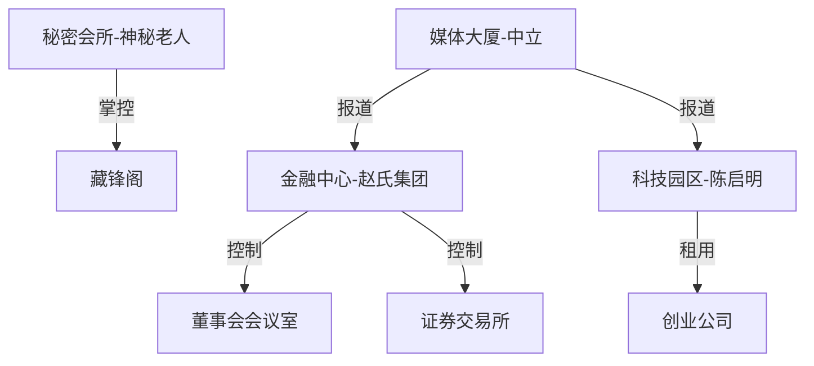

# 八门谋生 - 地点档案模板

## 权谋商战地点体系

基于奇门遁甲九宫系统，为权谋/商战故事提供空间场景。

---

## 一、地点分类

### 1. 商业核心区（九宫对应）

| 地点名 | 九宫归属 | 权谋意象 | 描写要点 | 首次出现 |
|--------|----------|----------|----------|----------|
| 金融中心 | 6宫乾 | 权力巅峰 | 摩天大楼、精英汇聚 | 第1章 |
| 科技园区 | 3宫震 | 创新突袭 | 年轻、活力、竞争 | 第3章 |
| 传媒大厦 | 9宫离 | 舆论战场 | 屏幕矩阵、直播现场 | 第4章 |
| 旧工业厂房 | 8宫艮 | 坚守/衰败 | 废弃、改造、情怀 | 第6章 |
| 咖啡馆/会所 | 7宫兑 | 谈判场所 | 私密、博弈、交易 | 第2章 |

### 2. 居住/私密区

| 地点名 | 类型 | 权谋属性 | 描写要点 | 首次出现 |
|--------|------|----------|----------|----------|
| 富人区别墅 | 2宫坤 | 资源掌控 | 奢华、安全感、距离感 | 第2章 |
| 城中村/旧小区 | 1宫坎 | 潜伏蛰伏 | 烟火气、隐蔽、市井 | 第1章 |
| 私人俱乐部 | 4宫巽 | 渗透暗箱 | 神秘、会员制、消息 | 第5章 |

### 3. 权力中心

| 地点名 | 类型 | 权谋属性 | 描写要点 | 首次出现 |
|--------|------|----------|----------|----------|
| 董事会会议室 | 5宫中 | 核心决策 | 压抑、博弈、生死 | 第7章 |
| 证券交易所 | 6宫乾 | 资本战场 | 大屏、狂热、紧张 | 第8章 |
| 法院/仲裁庭 | 7宫兑 | 合约博弈 | 严肃、对抗、裁决 | 第10章 |
| 顶级酒店宴会厅 | 9宫离 | 舆论场 | 光鲜、虚荣、交易 | 第6章 |

---

## 二、地点与权谋阶段映射

| 八门 | 典型地点 | 权谋场景 |
|------|----------|----------|
| 休门 | 茶馆、私人书斋、疗养院 | 蛰伏、等待、收集情报 |
| 生门 | 创业园区、融资路演、孵化器 | 找钱、找人、找方向 |
| 伤门 | 法庭、维权现场、冲突现场 | 攻击、侵权、撕破脸 |
| 杜门 | 研发中心、保密会议室、金库 | 保密、技术壁垒、信息差 |
| 死门 | 破产清算现场、ICU、太平间 | 终结、绝望、彻底失败 |
| 惊门 | 突发事件现场、新闻发布会 | 震惊、阴谋、心理战 |
| 景门 | 媒体发布会、社交晚宴、直播间 | 公关、宣传、舆论战 |
| 开门 | 上市仪式、签约仪式、新公司成立 | 开创、公开、扩张 |

---

## 三、地点状态追踪表

| 地点 | 当前状态 | 控制势力 | 安全等级 | 最后出现章节 | 备注 |
|------|----------|----------|----------|--------------|------|
| 金融中心写字楼 | 正常使用 | 赵氏集团 | 高 | 第5章 | 主角被禁止进入 |
| 城中村出租屋 | 正常使用 | 无 | 低 | 第1章 | 主角起始点 |
| 秘密会所"藏锋阁" | 营业中 | 神秘老人 | 极高 | 第2章 | 关键情报交易地 |
| 科技园区创业公司 | 起步中 | 陈启明 | 中 | 第5章 | 主角新基地 |
| 旧厂房改造空间 | 改造中 | 待定 | 低 | 第6章 | 潜在新据点 |

---

## 四、地点转移记录

| 章节 | 主角位置 | 场景描述 | 权谋阶段 |
|------|----------|----------|----------|
| 第1章 | 城中村出租屋 | 被裁员，收拾东西 | 休门-蛰伏 |
| 第2章 | 藏锋阁会所 | 神秘投资人见面 | 休门-情报 |
| 第3章 | 科技园区 | 租办公室，组建团队 | 生门-起步 |
| 第4章 | 投行会议室 | 林诗雨尽职调查 | 生门-融资 |
| 第5章 | 金融中心写字楼 | 天使签约仪式 | 生门-突破 |
| 第6章 | 顶级酒店宴会 | 行业峰会，公开亮相 | 景门-公关 |
| 第7章 | 董事会会议室 | 赵鹏发难，表决危机 | 伤门-攻击 |
| 第8章 | 证券交易所 | 上市路演，暗箱操作 | 开门-扩张 |

---

## 五、地点与势力映射



---

## 六、地点描写模板

### 谈判场所（7宫兑）

**模板**：

```
【场景名称】
位置：
装修风格：
光线特点：
声音环境：
权谋氛围：
典型事件：
```

**示例**：

```
【藏锋阁会所】
位置：旧租界区，花园洋房改造
装修风格：新中式，厚重木雕，屏风隔断
光线特点：暖色调，私密感，无窗
声音环境：古琴白噪音，安静到压抑
权谋氛围：来此者各有目的，表面风雅实则交易
典型事件：情报交换、暗中结盟、致命一击
```

### 权力中心（5宫中/6宫乾）

**模板**：

```
【场景名称】
位置：
建筑特点：
空间感：
权力符号：
压迫感来源：
典型事件：
```

**示例**：

```
【赵氏集团董事会会议室】
位置：金融中心顶层，38楼
建筑特点：落地窗可俯瞰全城，但窗帘常闭
空间感：长桌，两端为主位，周围坐满董事
权力符号：墙上书法《戒急用忍》，桌上铭牌
压迫感来源：沉默、眼神、不表态
典型事件：罢免表决、并购决议、权力洗牌
```

---

## 七、场景转换技巧

### 从低权谋区到高权谋区

```
城中村（1宫坎/休门） → 咖啡馆（7宫兑） → 会所（4宫巽/太阴） → 董事会（5宫中）
节奏：平静 → 接触 → 深入 → 决战
```

### 从公开到私密

```
公开场合（9宫离/景门） → 半公开（7宫兑） → 私密（1宫坎/4宫巽）
用途：制造舆论 → 初步接触 → 达成交易
```

---

*模板版本：v1.0.0 - 2026-04-03*