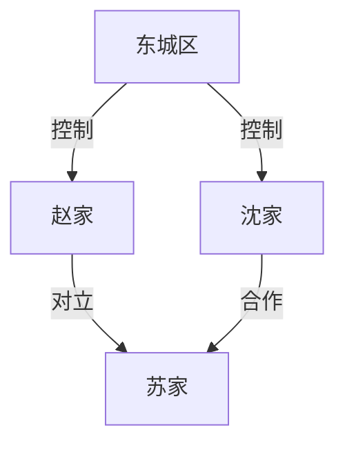

# 地点档案模板

## 常用地点类型

### 城市/区域

| 地点名 | 类型 | 描写要点 | 首次出现章节 |
|--------|------|----------|--------------|
| 东城区 | 主城 | 繁华、权贵聚集 | 第1章 |
| 西城区 | 主城 | 平民区、混乱 | 第2章 |

### 建筑/场所

| 地点名 | 类型 | 描写要点 | 首次出现章节 |
|--------|------|----------|--------------|
| 沈氏集团 | 公司 | 摩天大楼、冷峻 | 第1章 |
| 沈家老宅 | 豪宅 | 奢华、压抑 | 第3章 |

### 特殊区域

| 地点名 | 类型 | 描写要点 | 首次出现章节 |
|--------|------|----------|--------------|
| 修仙界入口 | 秘境 | 雾气缭绕、危险 | 第10章 |
| 遗迹古墓 | 副本 | 神秘、机遇 | 第15章 |

---

## 势力范围标记

---

## 地点转移记录

| 章节 | 主角位置 | 场景描述 |
|------|----------|----------|
| 第1章 | 街头 | 雨夜，被追债 |
| 第2章 | 医院 | 受伤住院 |
| 第3章 | 沈氏集团 | 面试 |
| 第4章 | 沈家老宅 | 被羞辱 |